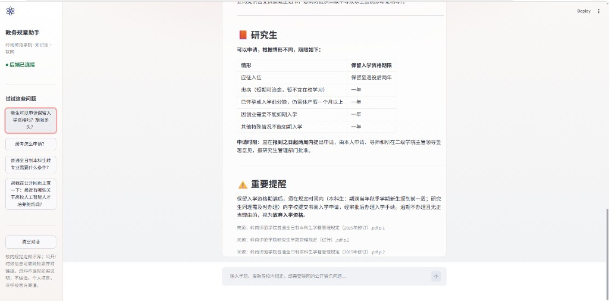
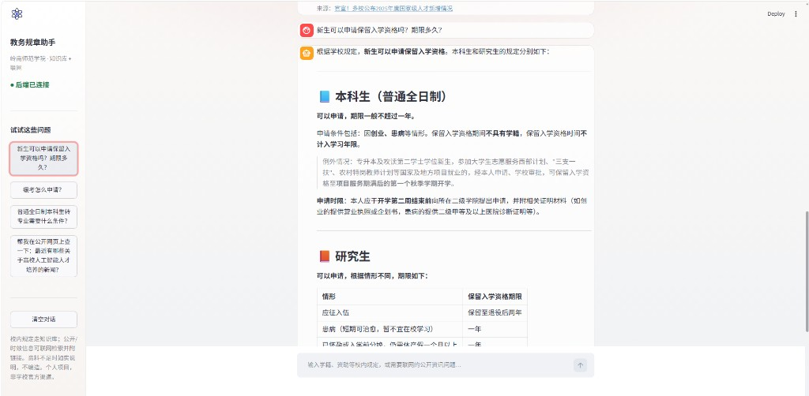
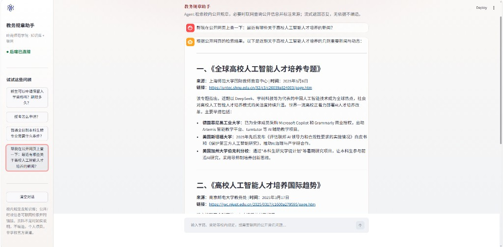

# 教务规章助手（岭南师范学院场景）

> 个人项目（独立完成），**非学校官方产品**。面向岭南师范学院公开教务规章：Hybrid 检索 + Rerank 之上接入 **Agent 多工具循环**——校内规定走知识库，公开/时效信息可走 Tavily 联网搜索；前端演示名「教务规章助手」。并用 Ragas 与拒答行为小金标做对照评估。

[](https://www.python.org/)
[](https://fastapi.tiangolo.com/)
[](https://www.langchain.com/)
[](https://langchain-ai.github.io/langgraph/)
[](https://github.com/explodinggradients/ragas)

---

## 项目亮点

1. **检索链路完整**：PDF 按页入库 → Recursive 切块 → BGE Embedding → Chroma → Query 改写 → Hybrid（向量 + BM25 + RRF）→ `bge-reranker-v2-m3` 精排 → 流式生成，并回传来源页码  
2. **Agent 多工具调度**：`POST /agent/stream` 上跑工具循环（默认 `LegacyRunner`，`AGENT_RUNNER=graph` 可切 LangGraph：think → act → observe）；校内规定优先 `search_lingnan_knowledge_base`，公开/时效问题可调用 `search_web_messages`（Tavily），Prompt 约束联网结果不能冒充官方规章  
3. **有对照实验，不只调通**：用 **50** 道自建题 + Ragas，对比有无 Rerank；四项指标均提升，Context Precision 约 **0.73 → 0.79**，Answer Relevancy 约 **0.65 → 0.83**  
4. **拒答行为有回归集**：另建 **30** 题（该答 10 / 部分答 10 / 该拒 10），人工记误拒与幻觉；当前 **误拒 3、幻觉 0**，不单凭感觉调 Prompt  
5. **前后端可演示**：Streamlit「教务规章助手」通过 `httpx` 解析 **SSE**（`token` / `action` / `observation` / `sources` / `done`）；校内来源展示 PDF 名/页码，联网来源展示标题与链接；工具步骤可展开；资料不足时如实说明、不编造。演示接口按 IP / 全站做 Redis 计数限流，超额返回 **429**

### Ragas 评估结果（50 题）

| 指标 | 无 Rerank | 有 Rerank | 差值 |
|------|----------:|----------:|-----:|
| Context Precision | 0.73 | **0.79** | +0.06 |
| Context Recall | 0.74 | **0.88** | +0.14 |
| Faithfulness | 0.86 | **0.89** | +0.03 |
| Answer Relevancy | 0.65 | **0.83** | +0.18 |

**怎么理解：** Rerank 改善进入生成的 Top3 质量（Precision / Relevancy 上升）；Recall 也会因最终 Top3 置换而变化，但**不能**捞到 Hybrid Top10 以外的块——两边仍 Recall=0 的题要回到切块 / 初筛上查。

### 拒答 / 幻觉行为回归（30 题）

| 指标 | 结果 |
|------|------|
| 题型 | 该答 10 / 部分答 10 / 该拒 10 |
| 行为准确 | **27/30** |
| 误拒 | **3/30**（心理电话、转专业名额、宿舍房型等「有制度缺精确字段」时整句拒答） |
| 幻觉 | **0/30**（该拒题未编造价格 / 时刻 / 网址等） |

金标与跑分：`evaluation/refusal_gold.json`、`evaluation/eval_refusal.py`。完整过程与逐题分析见 [docs/evaluation_report.md](./docs/evaluation_report.md)。

---

## 项目简介

直接问大模型教务规定，容易答错或编造。本项目把规章 PDF 切块并写入向量库，由 Agent 按需调用工具再生成：

- **校内规定**：优先 `search_lingnan_knowledge_base`（改写 → Hybrid → Rerank），只根据知识库作答  
- **公开/时效资讯**：可调用 `search_web_messages`（Tavily），须标明来自网页、不得冒充官方规章  
- **资料不足**：明确拒答或说明边界，不编造  

本地 MVP：后端负责 Agent 循环与 SSE 流式生成，前端负责对话、工具步骤与来源展示。完整规章 PDF **未公开收录**（体积与版权）；本地复现可自备同类 PDF 后按下方脚本入库。

---

## 系统架构

主路径是一次问答的完整生成周期（前端 → FastAPI Agent → 工具调用 → 流式生成）。离线入库与用户鉴权不在主图展开，见下方文字与[附录](#附录用户接口请求生命周期)。

**在线问答：用户请求完整生成周期**


**一次问答的数据流（当前前端主路径）：**

```text
用户（Streamlit）
    │  httpx SSE  POST /agent/stream
    ▼
FastAPI  agent router（Redis 限流）→ run()
    │  默认 LegacyRunner；AGENT_RUNNER=graph 时走 LangGraph
    │
    ├─ 工具 search_lingnan_knowledge_base
    │     Query 改写 → Hybrid（向量 + BM25 + RRF）→ Rerank → Top3
    │     返回 content + sources（PDF 名 / 页码 / 可选短摘录）
    │
    └─ 工具 search_web_messages（可选）
          Tavily Search → 摘要供模型阅读；sources 仅标题 + URL
    ▼
SSE 事件：thought / action / observation / token / sources / error / done
    ▼
前端「教务规章助手」：流式展示答案与工具步骤 → 解析 sources（PDF 或网页链接）
```

**兼容路径：** `POST /chat/stream` 仍保留纯 RAG 链式问答（不经 Agent 工具循环，`text/plain` 流式文本 + 末尾来源 JSON），便于对照与评测脚本复用。

**离线入库（一次构建知识库）：**

```text
data/pdfs → 按页抽文本 → Recursive 切块(256/50) → BGE Embedding
         → chroma_db（metadata: source, page）
```

---

## 核心能力

| 能力 | 说明 |
|------|------|
| **RAG 闭环** | 入库 → 切块 → Embedding → 检索 → 精排 → 生成 |
| **Query 改写** | 检索前改写用户问题，提升召回稳定性 |
| **混合检索** | 稠密向量 + `rank_bm25`，RRF 融合；中文分词用 jieba |
| **二次精排** | Hybrid Top10 → `bge-reranker-v2-m3` → Top3 |
| **Agent 工具循环** | LangChain `bind_tools` + 多轮 tool_call；知识库 / 联网分流。默认 `LegacyRunner`，可切 LangGraph（`think` → `act` → `observe`） |
| **联网搜索** | Tavily HTTP 检索，封装为 `search_web_messages`；校规结论仍以知识库为准 |
| **SSE 流式** | `POST /agent/stream`：`text/event-stream`（token / thought / action / observation / sources / error / done） |
| **演示限流** | Redis `INCR` + TTL：按 IP 小时/日、全站日限额；超额 **429** |
| **可溯源展示** | 知识库：PDF 名 + 页码；联网：标题 + 可点击链接；前端展示工具步骤 |
| **对照实验** | 切块 / Hybrid / Rerank / Ragas / 拒答小金标，见 `docs/` 与 `evaluation/` |
| **附带能力** | FastAPI 分层、JWT 登录、MySQL、用户接口 Redis 缓存（非主线，见[附录](#附录用户接口请求生命周期)） |

### 运行截图

**1. 知识库问答（保留入学资格 · 附 PDF 来源/页码）**






**2. 联网搜索（公开资讯 · 附网页标题与链接）**



**FastAPI Swagger（/docs）**


---

## 技术栈

| 层级 | 技术 |
|------|------|
| 前端 | Streamlit、httpx（SSE 客户端） |
| API | FastAPI、Uvicorn、Pydantic |
| Agent | LangChain tools、`bind_tools`、`LegacyRunner` / LangGraph、DeepSeek |
| RAG | ChromaDB、LangChain、Recursive 切块、BGE Embedding、rank_bm25、jieba、bge-reranker、Query 改写 |
| 联网 | Tavily Search API、httpx |
| 评估 | Ragas、自建 `ground_truth.json`（50 题）、拒答行为集 `refusal_gold.json`（30 题） |
| 数据 / 安全 | MySQL、SQLAlchemy、Redis（限流 + 用户缓存）、JWT |
| 工程 | python-dotenv、pytest、Docker Compose |

---

## 实验与评估（摘要）

完整数据、设置与局限说明：[docs/evaluation_report.md](./docs/evaluation_report.md)  
评估脚本与结果：`evaluation/eval_with_ragas.py`、`evaluation/eval_refusal.py`、`evaluation/results_*.json`、`evaluation/refusal_run.json`

| 实验 | 做了什么 | 结论（简） |
|------|----------|------------|
| **切块** | Naive / Character / Recursive，以及 128 / 256 / 512 | Recursive 更利于保留条款边界；当前采用 chunk_size=256、overlap=50 |
| **混合检索** | Dense vs Hybrid（向量 + BM25 + RRF） | Hybrid 稳住关键字侧；问题逐渐变成「候选对了但排序不理想」 |
| **Rerank** | Hybrid Top10 → 精排 Top3，探针看位次变化 | 精排接进生产检索链路，职责是重排，不扩大召回 |
| **Ragas** | 50 题，有无 Rerank 四指标对照 | 四项均提升；Precision +0.06，Recall +0.14，Relevancy +0.18 |
| **拒答小金标** | 30 题：该答 10 / 部分答 10 / 该拒 10，人工记误拒与幻觉 | 行为准确 27/30；误拒 3、幻觉 0；短板是缺细节时过拒 |

> 说明：上表评估主要针对 **知识库 RAG 链路**（检索质量与拒答行为）。Agent + 联网工具是线上主路径，尚未单独做与 Ragas 同规模的对照评测。

---

## 目录结构

```text
lingnan-university-rag/
├── main.py                 # Streamlit「教务规章助手」入口
├── frontend/               # 前端（默认请求 /agent/stream）
│   ├── components/         # 侧栏 / 对话（工具步骤 + 来源）
│   ├── api/                # httpx SSE 客户端
│   └── config.py           # 示例问题等
├── app/                    # FastAPI 后端
│   ├── agent/              # Agent 循环、事件与工具
│   │   ├── loop.py         # run()：默认 LegacyRunner；AGENT_RUNNER=graph 切 Graph
│   │   ├── graph.py        # LangGraph：think → act → observe
│   │   ├── events.py       # token / thought / action / observation / sources / error / done
│   │   ├── sse.py          # SSE 帧编码
│   │   └── tools.py        # 知识库工具 + 联网工具
│   ├── routers/            # users / auth / chat / agent
│   ├── core/               # 配置、限流、Redis、鉴权
│   └── rag/
│       ├── chain.py        # 检索与上下文格式化
│       ├── rewrite.py      # Query 改写
│       ├── hybrid.py       # 混合检索
│       ├── rerank.py       # Rerank
│       └── web_search.py   # Tavily 联网搜索
├── scripts/                # PDF 入库、检索探针
├── evaluation/             # Ragas / 拒答回归评估与结果
├── docs/
│   └── evaluation_report.md
├── data/                   # 本地语料目录（完整 PDF 未纳入本仓库）
├── playground/             # 早期检索/切块等实验脚本（非主线，可不看）
├── tests/                  # SSE、工具 payload、Legacy / Graph runner
├── docker/                 # Compose：MySQL + Redis + 后端 + 前端
├── image/                  # README 用架构图、Swagger / Streamlit 截图等
├── requirements.txt            # 后端 / Docker API 运行时
├── requirements-frontend.txt   # Streamlit 前端
├── requirements-dev.txt        # 本地全量：后端 + 前端 + 测试/评估
├── .env.example
└── README.md
```

> 目录说明以仓库已跟踪内容为准。本地未提交的实验文件（如更新的 playground 脚本）不写入上表，避免与 GitHub 不一致。

---

## 快速开始

> 阅读本 README 即可了解设计与实验结果。若要本地跑通，需要自备 API Key、MySQL、Redis，以及若干规章类 PDF。联网工具另需 Tavily Key。

### 1. 环境

需要 **Python ≥ 3.11**（Docker 镜像与徽章均为 3.11）。

```bash
git clone https://github.com/wuziqing2003/lingnan-university-rag.git
cd lingnan-university-rag
python -m venv .venv
```

Windows:

```bash
.venv\Scripts\activate
pip install -r requirements-dev.txt
copy .env.example .env
```

Docker 后端镜像只装运行时：`pip install -r requirements.txt`；前端镜像：`pip install -r requirements-frontend.txt`。

在 `.env` 中填写 `DEEPSEEK_API_KEY`、`SiliconFlow_API_KEY`、`TAVILY_API_KEY`、`DB_*`、`SECRET_KEY`、`REDIS_*`、演示限额 `DEMO_*` 等（**不要提交 `.env`**）。可选 `AGENT_RUNNER=graph` 启用 LangGraph，默认 `legacy`。

将 PDF 放到 `data/pdfs/` 后执行入库（生成 `chroma_db/`，该目录默认不提交）：

```bash
python scripts/ingest_pdfs.py
```

也可用 Compose 拉起 MySQL、Redis、后端与前端（仍需本机先入库，API 镜像默认不含 `chroma_db`）：

```bash
cd docker
docker compose up --build
```

### 2. 启动后端

```bash
python -m app.main
```

- API 文档：http://127.0.0.1:8000/docs  
- 健康检查：http://127.0.0.1:8000/health  

> 请用 `python -m app.main` 从项目根目录启动；直接 `python app/main.py` 可能出现 `No module named 'app'`。

默认 Agent 为 `LegacyRunner`。改用 LangGraph：

```bash
# Windows PowerShell
$env:AGENT_RUNNER="graph"
python -m app.main
```

### 3. 启动前端

另开终端：

```bash
streamlit run main.py
```

侧边栏显示「后端已连接」后即可提问。界面为「教务规章助手」：校内规定走知识库，公开资讯可点示例题体验联网；默认请求 `POST /agent/stream`。额度用尽时前端会展示后端返回的 429 说明。

### 4. 测试与评估（可选）

```bash
pytest -v
python evaluation/eval_with_ragas.py --mode rerank
python evaluation/eval_refusal.py
```

当前测试覆盖 SSE 编解码、工具 payload 解析、以及 Legacy / Graph runner 的事件顺序与工具失败回退。

### 流式问答示例

Agent（与前端一致，SSE）：

```bash
curl -N -X POST http://127.0.0.1:8000/agent/stream ^
  -H "Content-Type: application/json" ^
  -H "Accept: text/event-stream" ^
  -d "{\"question\":\"研究生国家奖学金和国家助学金有什么区别？\"}"
```

纯 RAG 兼容接口（纯文本流 + 末尾来源 JSON）：

```bash
curl -N -X POST http://127.0.0.1:8000/chat/stream ^
  -H "Content-Type: application/json" ^
  -d "{\"question\":\"研究生国家奖学金和国家助学金有什么区别？\"}"
```

---

## 当前不足

- 评估集现为 Ragas 50 题 / 拒答 30 题，结论仍不宜外推到全部规章问答；Agent + 联网路径尚未单独做同规模评测  
- 仍有题目两边 Context Recall 为 0：所需段落可能未进入 Hybrid Top10，Rerank 帮不上，需要回头查切块、分词或初筛  
- 拒答回归里仍有 3 题误拒：有相关制度但缺精确字段（电话 / 名额 / 宿舍房型）时，模型会整句拒答，偏「过拒」  
- Agent 默认仍是 `LegacyRunner`，LangGraph 需 `AGENT_RUNNER=graph`；两条路径并存，演示与文档需自行对齐  
- Rerank / Tavily 依赖外部 API，会增加延迟与对密钥/网络的依赖  
- 模型无内置实时时钟：像「今天几号」这类问题需注入当前日期或增加时间工具，不能单靠知识库/网页碰运气  

---

## 附录：主要 API

| 方法 | 路径 | 说明 |
|------|------|------|
| GET | `/health` | 健康检查 |
| POST | `/agent/stream` | **主接口**：Agent 工具循环，SSE（`text/event-stream`） |
| POST | `/chat/stream` | 兼容：纯 RAG 流式问答（`text/plain`，答案后附带来源 JSON） |
| POST | `/user` | 用户注册 |
| GET | `/user/{id}` | 按 id 查询（Redis 缓存） |
| GET | `/user` | 用户分页列表 |
| POST | `/login` | 登录，返回 JWT |
| GET | `/profile` | 当前用户信息（Bearer Token） |

`/agent/stream` 事件类型：

| event | 含义 |
|-------|------|
| `thought` | 模型在调用工具前的思考（LangGraph 路径） |
| `action` | 即将调用的工具名与参数 |
| `observation` | 工具返回摘要 |
| `token` | 最终回答的流式增量 |
| `sources` | 知识库页码或网页链接 |
| `error` | 失败信息（工具失败时不假装已检索到规章） |
| `done` | 本轮结束 |

## 附录：用户接口请求生命周期

> 非 RAG 主路径。对应注册 / 登录 / 按 id 查用户等接口，体现 FastAPI 分层、Schema 校验、Redis Cache-Aside 与全局异常处理。


