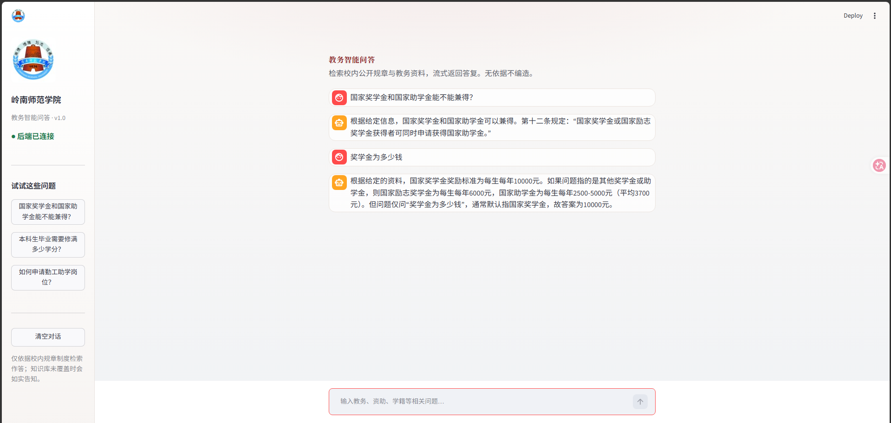
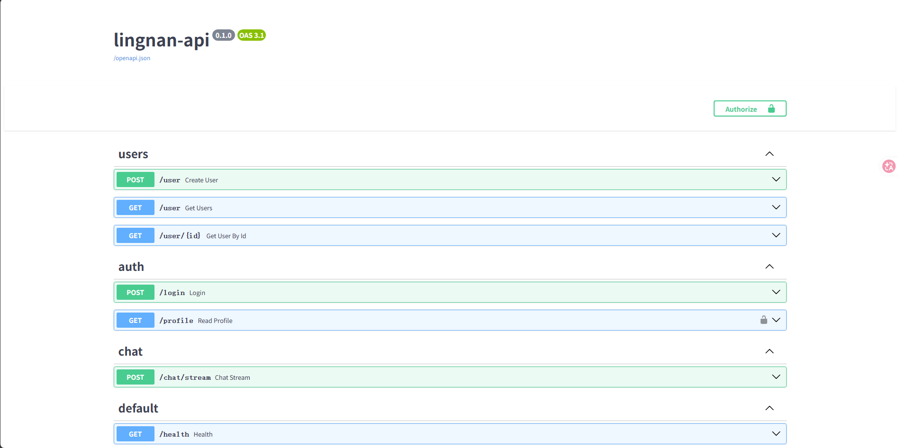

# 高校教务规章 RAG 问答系统

> 个人项目（独立完成）。用学校公开教务规章 PDF 做知识库，实现「检索 + 生成」的问答：Hybrid 检索、Cross-Encoder 精排，并用 Ragas 做有无 Rerank 的定量对照。

[](https://www.python.org/)
[](https://fastapi.tiangolo.com/)
[](https://www.langchain.com/)
[](https://github.com/explodinggradients/ragas)

**求职相关方向：** 大模型应用 / RAG 应用 / Python 后端（AI）实习

---

## 项目亮点

1. **检索链路完整**：PDF 入库 → Recursive 切块 → BGE Embedding → Chroma → Hybrid（向量 + BM25 + RRF）→ `bge-reranker-v2-m3` 精排 → Prompt 约束 → DeepSeek 流式生成  
2. **有对照实验，不只调通**：用 15 道自建题 + Ragas，对比有无 Rerank；Context Precision 从约 **0.67 提升到 0.90**  
3. **前后端可演示**：Streamlit 通过 `httpx` 调用 FastAPI `POST /chat/stream`，资料不足时要求模型拒答，减轻幻觉

### Ragas 评估结果（15 题）

| 指标 | 无 Rerank | 有 Rerank | 差值 |
|------|----------:|----------:|-----:|
| Context Precision | 0.67 | **0.90** | +0.23 |
| Context Recall | 0.83 | 0.83 | 0 |
| Faithfulness | 0.96 | 0.98 | +0.02 |
| Answer Relevancy | 0.83 | 0.86 | +0.03 |

**怎么理解：** Rerank 主要改善进入生成的 Top3 排序（Precision 明显上升）；Recall 两组相同，说明精排不会扩大召回，漏召回仍要回到切块 / Hybrid 初筛上查。完整过程与逐题分析见 [docs/evaluation_report.md](./docs/evaluation_report.md)。

---

## 项目简介

直接问大模型教务规定，容易答错或编造。本项目把规章 PDF 切块并写入向量库，回答时先检索再生成，并在 Prompt 里要求：只根据检索到的内容作答，资料不够就明确说明。

这是一个可本地运行的 MVP：后端负责检索与流式生成，前端负责对话展示。仓库中的完整规章 PDF **未公开收录**（体积与版权考虑）；若要本地复现，可自备同类 PDF，按下方入库脚本处理。

---

## 系统架构


**一次问答的数据流：**

```text
用户（Streamlit）
    │  httpx stream  POST /chat/stream
    ▼
FastAPI  chat router
    │  rag_chain.astream(question)
    ▼
Hybrid 检索（Chroma 向量 + BM25 + RRF）→ Top10 候选
    ▼
Rerank（bge-reranker-v2-m3）→ Top3 上下文
    ▼
Prompt（仅依据检索资料作答）→ DeepSeek 流式生成 → 前端输出
```

---

## 核心能力

| 能力 | 说明 |
|------|------|
| **RAG 闭环** | 入库 → 切块 → Embedding → 检索 → 精排 → 生成 |
| **混合检索** | 稠密向量 + `rank_bm25`，RRF 融合；中文分词用 jieba |
| **二次精排** | Hybrid Top10 → `bge-reranker-v2-m3` → Top3，改善「相关块在池中但排得偏后」 |
| **流式接口** | `POST /chat/stream`，前端不直连大模型 SDK |
| **对照实验** | 切块 / Hybrid / Rerank / Ragas，见 `docs/` 与 `evaluation/` |
| **附带能力** | FastAPI 分层、JWT 登录、MySQL、Redis 缓存（非本项目主线，见文末附录） |

### 运行截图

**Streamlit 问答界面**



**FastAPI Swagger（/docs）**



---

## 技术栈

| 层级 | 技术 |
|------|------|
| 前端 | Streamlit、httpx |
| API | FastAPI、Uvicorn、Pydantic |
| RAG | ChromaDB、LangChain LCEL、Recursive 切块、BGE Embedding、rank_bm25、jieba、bge-reranker、DeepSeek |
| 评估 | Ragas、自建 `ground_truth.json`（15 题） |
| 数据 / 安全 | MySQL、SQLAlchemy、Redis、JWT（附录能力） |
| 工程 | python-dotenv、pytest |

---

## 实验与评估（摘要）

完整数据、设置与局限说明：[docs/evaluation_report.md](./docs/evaluation_report.md)  
评估脚本与结果：`evaluation/eval_with_ragas.py`、`evaluation/results_*.json`

| 实验 | 做了什么 | 结论（简） |
|------|----------|------------|
| **切块** | Naive / Character / Recursive，以及 128 / 256 / 512 | Recursive 更利于保留条款边界；当前采用 chunk_size=256、overlap=50 |
| **混合检索** | Dense vs Hybrid（向量 + BM25 + RRF） | Hybrid 稳住关键字侧；问题逐渐变成「候选对了但排序不理想」 |
| **Rerank** | Hybrid Top10 → 精排 Top3，探针看位次变化 | 精排接进生产检索链路，职责是重排，不扩大召回 |
| **Ragas** | 15 题，有无 Rerank 四指标对照 | Precision 提升明显；Recall 不变；Faithfulness / Relevancy 略升 |

---

## 目录结构

```text
lingnan-university-rag/
├── main.py                 # Streamlit 入口
├── frontend/               # 前端
├── app/                    # FastAPI 后端
│   ├── routers/            # users / auth / chat
│   └── rag/
│       ├── chain.py        # LCEL RAG 链路
│       ├── hybrid.py       # 混合检索
│       └── rerank.py       # Rerank
├── scripts/                # PDF 入库、检索探针
├── evaluation/             # Ragas 评估与结果
├── docs/
│   └── evaluation_report.md
├── data/                   # 本地语料目录（完整 PDF 未纳入本仓库）
├── playground/             # 实验脚本
├── tests/
├── image/
├── requirements.txt
├── .env.example
└── README.md
```

---

## 快速开始

> 阅读本 README 即可了解设计与实验结果。若要本地跑通，需要自备 API Key、MySQL、Redis，以及若干规章类 PDF。

### 1. 环境

```bash
git clone https://github.com/wuziqing2003/lingnan-university-rag.git
cd lingnan-university-rag
python -m venv .venv
```

Windows:

```bash
.venv\Scripts\activate
pip install -r requirements.txt
copy .env.example .env
```

在 `.env` 中填写 `DEEPSEEK_API_KEY`、`SiliconFlow_API_KEY`、`DB_*`、`SECRET_KEY`、`REDIS_*` 等（**不要提交 `.env`**）。

将 PDF 放到 `data/pdfs/` 后执行入库（生成 `chroma_db/`，该目录默认不提交）：

```bash
python scripts/ingest_pdfs.py
```

### 2. 启动后端

```bash
python -m app.main
```

- API 文档：http://127.0.0.1:8000/docs  
- 健康检查：http://127.0.0.1:8000/health  

### 3. 启动前端

```bash
streamlit run main.py
```

侧边栏显示「后端已连接」后即可提问。

### 4. 测试与评估（可选）

```bash
pytest -v
python evaluation/eval_with_ragas.py --mode rerank
```

### 流式问答示例

```bash
curl -N -X POST http://127.0.0.1:8000/chat/stream ^
  -H "Content-Type: application/json" ^
  -d "{\"question\":\"研究生国家奖学金和国家助学金有什么区别？\"}"
```

---

## 当前不足

- 评估集目前 15 题，结论不宜外推到全部规章问答  
- 部分题目 Context Recall 为 0：所需段落可能未进入 Hybrid Top10，Rerank 帮不上，需要回头查切块、分词或初筛  
- Rerank 依赖外部 API，会增加延迟与对密钥/网络的依赖  


---

## 附录：主要 API

| 方法 | 路径 | 说明 |
|------|------|------|
| GET | `/health` | 健康检查 |
| POST | `/chat/stream` | RAG 流式问答（主接口） |
| POST | `/user` | 用户注册 |
| GET | `/user/{id}` | 按 id 查询（Redis 缓存） |
| GET | `/user` | 用户分页列表 |
| POST | `/login` | 登录，返回 JWT |
| GET | `/profile` | 当前用户信息（Bearer Token） |
